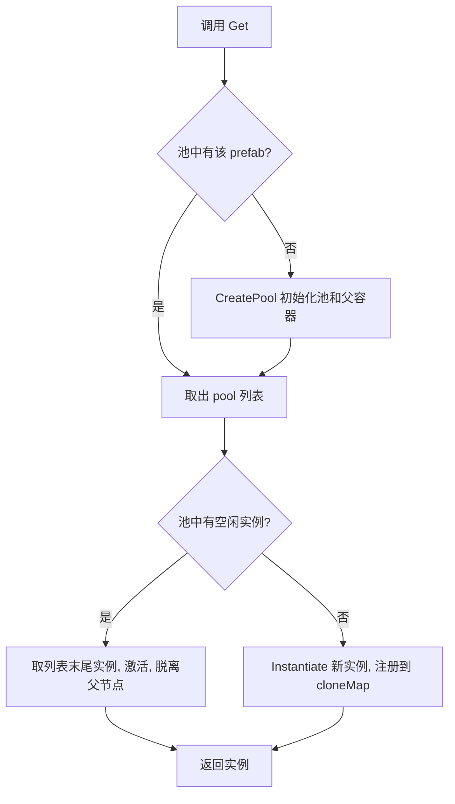
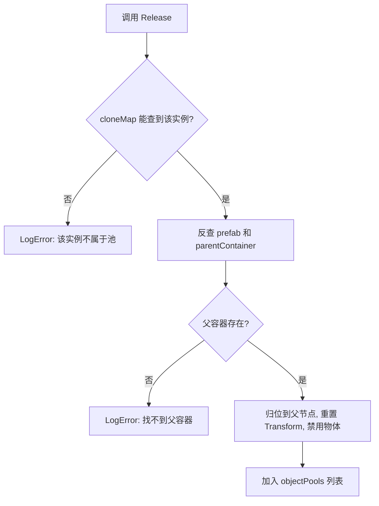
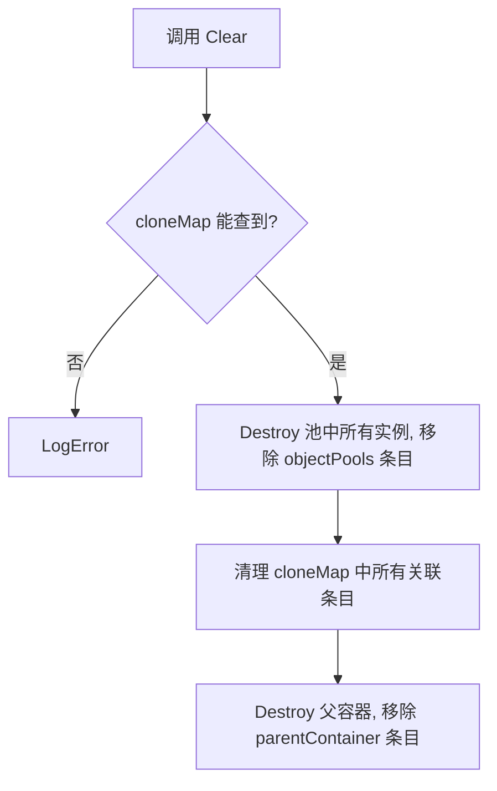

# GameObjectPool 设计文档

## 背景
- 回收场景中需要频繁实例化的预制件，避免重复 Instantiate/Destroy 带来的 GC 和性能开销

## 核心决策
### 1. 为什么需要设计 3 个字典字段？
- **objectPools**：prefab → 实例列表。通过 prefab 快速找到对应的实例池，取用或回收实例
- **cloneMap**：实例 → prefab（反向映射）。Release 时只知道实例本身，通过它 O(1) 反查所属预制体，无需遍历所有池
- **parentContainer**：prefab → 父节点。回收的实例统一挂在该父节点下，保持 Hierarchy 整洁

### 2. 为什么用 List 尾部取/删（栈式）而非 Queue？
- RemoveAt(末尾) 是 O(1)，且 LIFO 让最近回收的物体优先复用，CPU 缓存命中率更高

## 工作流程
### Get（获取实例）

### Release（回收实例）

### Clear（清空池）

## 已知限制
- 不支持自动扩容/缩容，池大小无限增长
- 场景切换时不自动清理，需手动调 Clear()
- 大量预热 Instantiate 会卡主线程