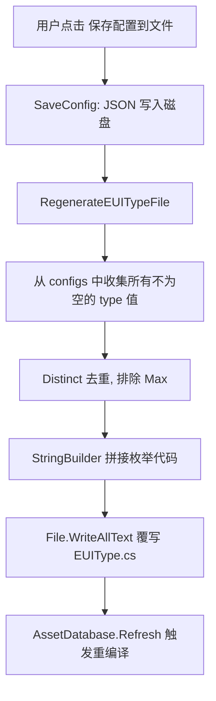
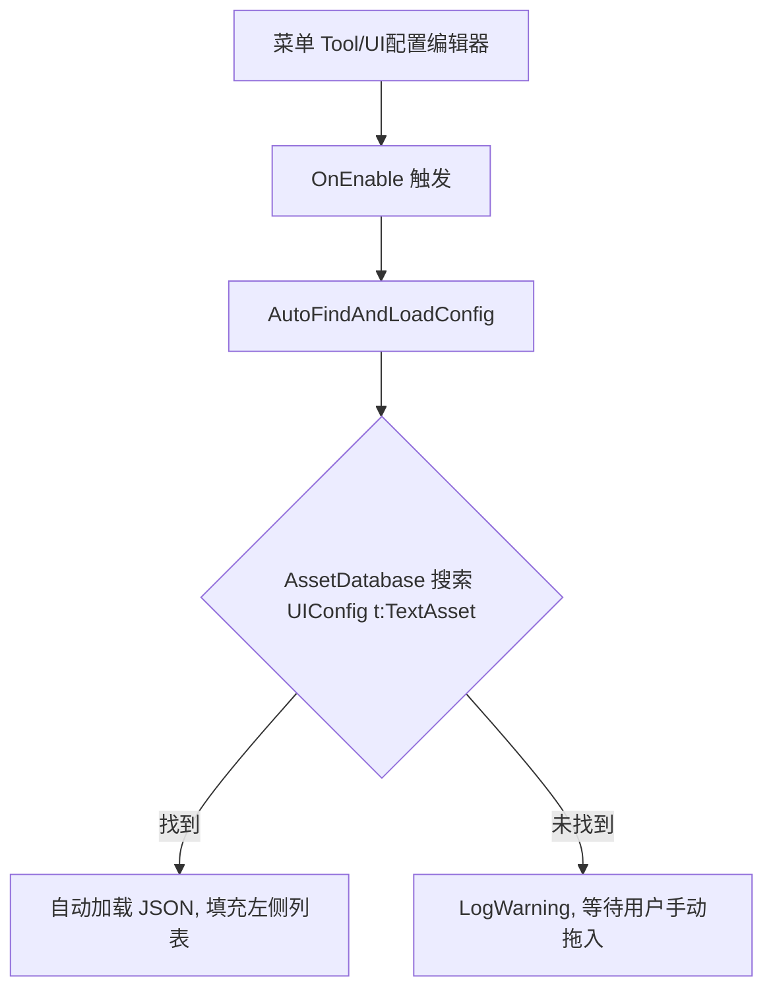
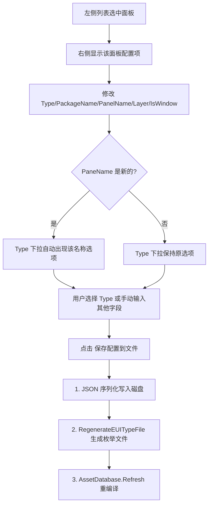
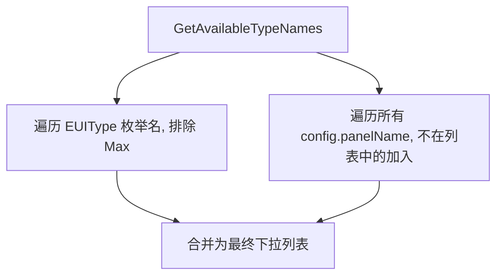

# UIConfigEditorWindow 设计文档

## 背景
- 项目中 UI 面板配置存储在 `UIConfig.json` 中，手动编辑 JSON 易出错且不直观
- `EUIType` 枚举需要在添加新面板时手动维护，容易遗漏或顺序错乱
- 需要一个可视化编辑器来管理所有 UI 面板的配置，并自动同步 `EUIType` 枚举

## 核心决策

### 问题1：为什么 `AutoFindAndLoadConfig` 中查找 UIConfig 要在后面加 `t:TextAsset`？

- `AssetDatabase.FindAssets` 的搜索字符串遵循 Unity 的搜索语法：`"名称 过滤器"`。只写 `"UIConfig"` 会匹配**所有类型**的资源（脚本、材质、预制体等），可能返回大量无关结果
- `t:TextAsset` 是类型过滤器，限定只搜索 TextAsset 类型的资源。`.json` 文件在 Unity 中导入后就是 TextAsset，这样搜索结果精准且效率更高
- 如果项目中有名为 `UIConfig` 的脚本或其他资源，加上 `t:TextAsset` 可以避免误匹配

### 问题2：为什么 `DrawTopArea` 中一开始是先绘制一个垂直区域而不直接绘制水平区域？

- 外层 `BeginVertical("box")` 的作用是**绘制一个带边框的容器盒子**（传入 `"box"` 参数会渲染 Unity 默认的 box 样式背景），将顶部整个文件选择区域包裹在一个视觉分组内
- 内层 `BeginHorizontal` 才真正开始水平排列控件（Label + ObjectField + Button + 路径文本）
- 如果不加外层垂直盒子，顶部的多个控件会与下方的主区域在视觉上混在一起，缺乏层次感。这是一种**外层负责视觉容器、内层负责布局方向**的惯用写法

```
┌───────────────────────────────── BeginVertical("box") ─────────────────────┐
│  ┌── BeginHorizontal ──────────────────────────────────────────────────┐   │
│  │  Label  │  ObjectField  │  Button  │  路径文本...                    │   │
│  └─────────────────────────────────────────────────────────────────────┘   │
└────────────────────────────────────────────────────────────────────────────┘
```

### 问题3：EUIType 文件是如何自动生成的？

- C# 的 `enum` 是编译期常量，运行时无法动态增减成员，因此采用**代码生成**策略
- 触发时机：每次点击"保存配置到文件"后，`SaveConfigs()` 末尾调用 `RegenerateEUITypeFile()`

**生成流程：**



**生成的代码结构：**

```csharp
public enum EUIType
{
    TestPanel,
    TestPanel01,
    TestPanel02,
    SetPanel,    // ← 用户在编辑器中新增的面板名
    Max          // ← 始终在最后，用作计数/边界标记
}
```

- 所有 `type` 值按收集顺序排列，`Max` 强制追加在末尾，确保它的语义"枚举总数/边界"始终正确

## 工作流程

### 打开窗口



### 编辑与保存



### Type 下拉选项构建



## 已知限制
- 保存后触发 `AssetDatabase.Refresh` + 脚本重编译，编辑器窗口会短暂刷新（Unity Editor 自身机制，无法绕过）
- `EUIType.cs` 生成路径硬编码为 `Assets/Scripts/UI/EUIType.cs`，若移动文件位置需同步修改
- 不支持撤销/重做（Undo），建议保存前确认修改
- 删除面板时不会自动清理 `EUIType` 中已注册的枚举值（避免误删其他配置仍有引用的类型）
